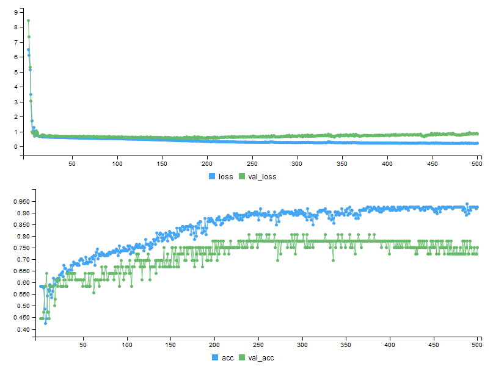

```{r setup, include=FALSE}
knitr::opts_chunk$set(echo = TRUE)
```

This document contains code for the [machine learning with a heart](https://www.drivendata.org/competitions/54/machine-learning-with-a-heart/page/107/) competition hosted at [DrivenData](https://www.drivendata.org/).  The goal is to predict the presence of a heart condition based on a set of 14 variables, including categorical, binary and numeric measures.  See the competition website for a more detailed description of the data.  

The bechmark for predictions is a simple logistic regression of the response, `heart_disease_present` as a function of the other variables, which gives a log loss (the evaluation metric for this problem) of 0.5381.  Let's see if we can do better!  

First, we'll load  and inspect the data:

```{r data, message=FALSE, warning=FALSE}
library(tidyverse)

x_train_raw <- read_csv("https://s3.amazonaws.com/drivendata/data/54/public/train_values.csv")
y_train_raw <- read_csv("https://s3.amazonaws.com/drivendata/data/54/public/train_labels.csv")
x_test_raw <- read_csv("https://s3.amazonaws.com/drivendata/data/54/public/test_values.csv")

glimpse(x_train_raw)

```

So, 13 predictors (ignoring the patient ID), of varying types and scales.  As a first pass, I'm not going to worry too much about transforming the variables, let's just work with the raw data and see what we get.

## Random Forest

We'll start out with a random forest approach, using the `ranger` package.  This data isn't huge, so ranger fits *really* fast - I'm just going to use a simple grid search to tune the major hyperparameters, `ntrees` and `mtry`, the number of trees in the forest and the number of variables randomly assigned to each tree, respectively.

```{r rf, warning=FALSE, message=FALSE}
library(ranger)
library(MLmetrics)

# join predictors and response into single data frame, and remove unnessary ID variable
train_data <- left_join(x_train_raw, y_train_raw) %>%
  select(-patient_id)

# train the model across range of hyperparameters
rf_models <- expand.grid(ntrees = seq(300, 3000, by = 100), mtry = seq(13))
rf_models$logloss <- NA

for (i in seq(nrow(rf_models))) {
  rf_model <- ranger(heart_disease_present ~ .,            # use all of the predictors
                     data = train_data, 
                     num.trees = rf_models$ntrees[i], 
                     mtry = rf_models$mtry[i],
                     respect.unordered.factors = "order",  # automatically dummify categorical variables
                     probability = T)                      # output label probabilities, needed for evaluation
  # calculate evaluation metric
  rf_models$logloss[i] <- LogLoss(rf_model$predictions[,2], train_data$heart_disease_present)
}
```

Visualizing the results in a heatmap:

```{r rf_vis}
ggplot(rf_models, aes(x = ntrees, y = mtry, fill = logloss)) + 
  geom_tile()
```

Around 3-5 variables per tree seems to do the best, without a stong signal in the number of trees over the range presented here.  Let's pick the best performing model on the training set and make some predictions.

```{r rf_preds}
winner <- rf_models[which.min(rf_models$logloss),]

rf_winner <- ranger(heart_disease_present ~ ., 
                   data = train_data, 
                   num.trees = winner$ntrees, 
                   mtry = winner$mtry,
                   respect.unordered.factors = "order",
                   probability = T)

# generate test set predictions in submission format
final.preds.rf <- data.frame(patient_id = x_test_raw$patient_id, 
                             heart_disease_present = predict(rf_winner, data = x_test_raw)$predictions[,2])
```

Submitting these predictions to the competition website, we get a log loss on the test set of 0.37371.  Not bad for virtually zero data preprocessing!  Somewhat suprisingly, the log loss on the test set is lower than the training data, so we're probably not horrendously overfit either.  At the time of submission, this score came in at number 30 out of 180 competitors.

## Neural Network

Alright, so a very simple random forest can put us in the top 20%, can a neural net do any better?  Let's construct a smallish multilayer perceptron, and see how it compares.

```{r mlp_prep, message=FALSE}
library(keras)
library(dummies)

# data prep - we need fully numeric matrices to feed into the NN

train_patient_id <- x_train_raw$patient_id
x_train_data <- select(x_train_raw, -patient_id)

x_train <- x_train_data %>% 
  as.data.frame() %>%
  dummy.data.frame(., names = c("thal"), sep = "_") %>%
  as.matrix()

test_patient_id <- x_test_raw$patient_id
x_test_data <- select(x_test_raw, -patient_id)

x_test <- x_test_data %>% 
  as.data.frame() %>%
  dummy.data.frame(., names = c("thal"), sep = "_") %>%
  as.matrix()

y_train <- y_train_raw$heart_disease_present

# define model - multilayer perceptron architecture, with a few extra hidden layers for fun
  # I've used a truncated normal distribution to initialize the model weights here -
  # training with the default uniform initializers tends to get stuck
model <- keras_model_sequential() %>%
  layer_dense(units = 16, activation = 'relu', kernel_initializer = 'glorot_normal', input_shape = c(15)) %>% 
  layer_dense(units = 16, activation = 'relu', kernel_initializer = 'glorot_normal') %>%
  layer_dense(units = 16, activation = 'relu', kernel_initializer = 'glorot_normal') %>%
  layer_dense(units = 16, activation = 'relu', kernel_initializer = 'glorot_normal') %>%
  layer_dense(units = 1, activation = 'sigmoid') # output probability vector for each digit

# compile model
model %>% compile(
  loss = 'binary_crossentropy',
  optimizer = 'adam',
  metrics = c('accuracy')
)
```

```{r mlp_train, eval=FALSE}
# train model, using callback to pick the best one
history <- model %>% fit(
  x_train, y_train, 
  epochs = 400, 
  batch_size = 48, 
  validation_split = 0.2,
  callbacks = list(
    callback_model_checkpoint("best_model.hdf5", save_best_only = T)
  )
)
```

The callback in the fitting function will save the model that minimizes the log loss (by default) on the validation set over the training period.  This will save us from overfitting and the corresponding drop in accuracy on validation (and presumably test) data, which in this case happens around 200 training epochs:

```{r mlp_vis, echo=FALSE, out.width = '90%'}

```

Lets load the winning model from the callback and generate our test predictions.

```{r mlp_pred}
final_model <- load_model_hdf5("best_model.hdf5")
final.preds.mlp <- data.frame(patient_id = test_patient_id, 
                              heart_disease_present = predict_proba(final_model, x_test))
```

So, we have a similar loss on the training data as the random forest approach, and about 83% validation accuracy.  Not bad, again considering there was effectively zero preprocessing of this data.  And submitting in competition, we get a nearly identical result as the random forest approach, with a test set log loss of 0.37390.

